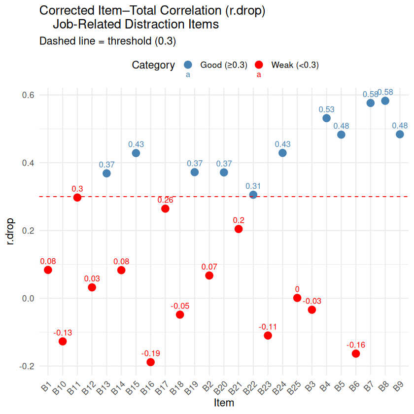
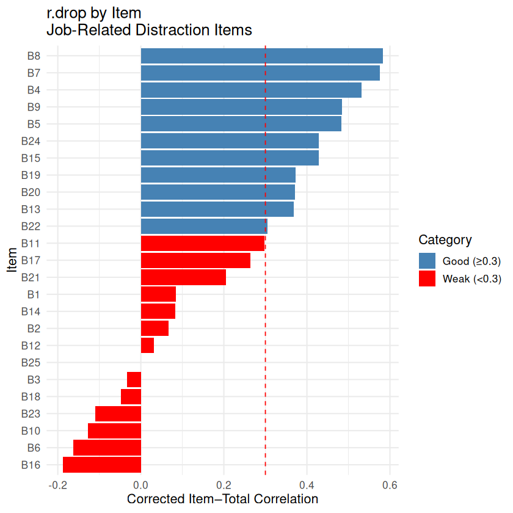
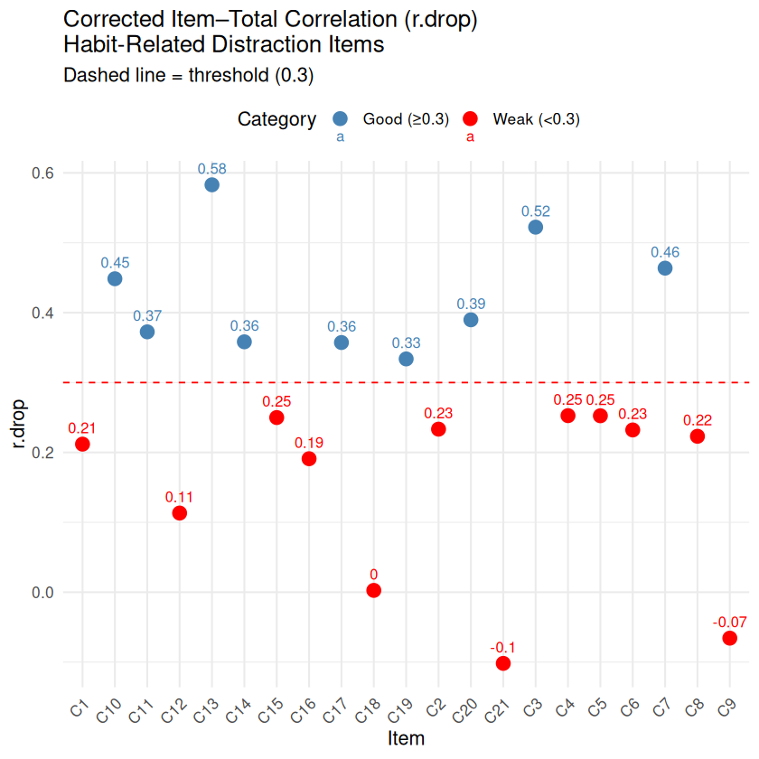
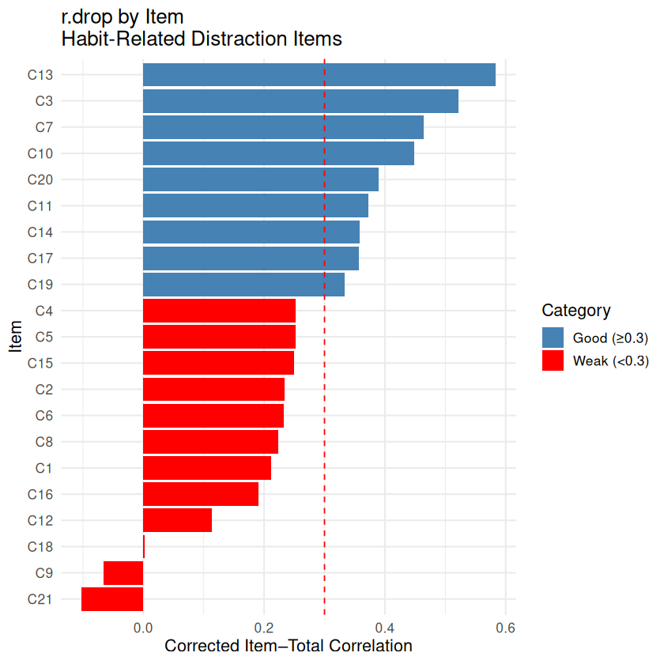

# Distraction-calculator

**Results of Cronbach's Alpha test:**

1. **CÁC CÂU HỎI LIÊN QUAN ĐẾN CÔNG VIỆC**

**1.1. scatter plot**

  

**1.2. bar plot**

  

2. **CÁC CÂU HỎI VỀ THÓI QUEN**

**2.1. scatter plot**

  

**2.2. bar plot**

  

